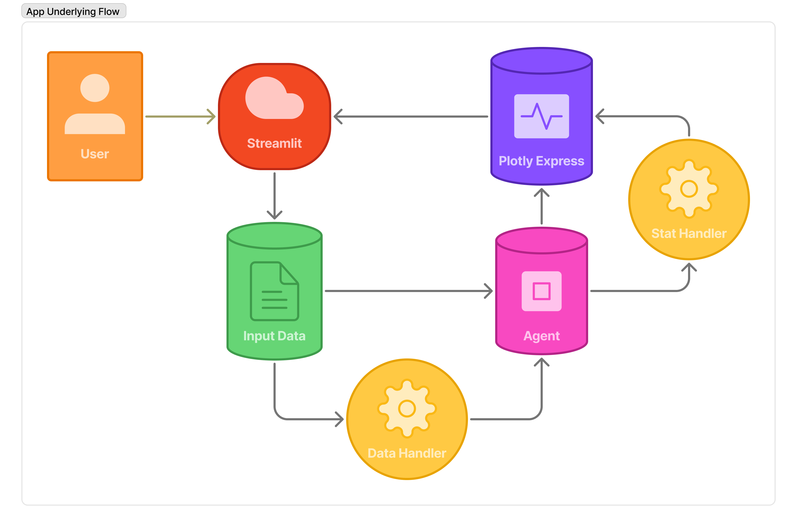

<a name="readme-top"></a>

<div align="center">

[![Forks][forks-shield]][forks-url]
[![Stargazers][stars-shield]][stars-url]
[![Issues][issues-shield]][issues-url]

</div>

<br />
<div align="center">
  <a href="https://github.com/drod75/DashboardAI">
    
  </a>

<h3 align="center">DashboardAI</h3>

  <p align="center">
    An AI agent for automated dashboard creation using Streamlit and LangChain.
    <br />
    <a href="https://github.com/drod75/DashboardAI/issues">Report Bug</a>
    ·
    <a href="https://github.com/drod75/DashboardAI/issues">Request Feature</a>
  </p>
</div>

<details>
  <summary>Table of Contents</summary>
  <ol>
    <li>
      <a href="#about-the-project">About The Project</a>
      <ul>
        <li><a href="#built-with">Built With</a></li>
      </ul>
    </li>
    <li>
      <a href="#getting-started">Getting Started</a>
      <ul>
        <li><a href="#prerequisites">Prerequisites</a></li>
        <li><a href="#setup">Setup</a></li>
        <li><a href="#usage">Usage</a></li>
      </ul>
    </li>
    <li><a href="#demo">Demo</a></li>
    <li><a href="#contributing">Contributing</a></li>
    <li><a href="#license">License</a></li>
    <li><a href="#contact">Contact</a></li>
  </ol>
</details>

## About The Project

[![Product Name Screen Shot][product-screenshot]](https://github.com/drod75/DashboardAI)

DashboardAI revolutionizes data analysis by leveraging a powerful AI agent built with LangChain. This tool provides an intuitive Streamlit interface to automate the creation of insightful dashboards. Users can effortlessly upload various file types and watch as the agent processes the data, generating dynamic and informative graphs with Plotly Express. Say goodbye to manual dashboard configuration and hello to intelligent, on-the-fly data visualization.



<p align="right">(<a href="#readme-top">back to top</a>)</p>

### Built With

* [![Streamlit][Streamlit-shield]][Streamlit-url]
* [![LangChain][LangChain-shield]][LangChain-url]
* [![LangGraph][LangGraph-shield]][LangGraph-url]
* [![Plotly][Plotly-shield]][Plotly-url]
* [![Pandas][Pandas-shield]][Pandas-url]
* [![Google Gemini][Gemini-shield]][Gemini-url]

<p align="right">(<a href="#readme-top">back to top</a>)</p>

## Getting Started

To get a local copy up and running follow these simple example steps.

### Prerequisites

This project uses Python. You can use `pip` or `uv` for package management.

* To install `pip` dependencies:
  ```sh
  pip install --upgrade pip
  ```
* To install `uv`:
  ```sh
  pip install uv
  ```

### Setup

1.  **Clone the repo**
    ```sh
    git clone https://github.com/drod75/DashboardAI.git
    ```
2.  **Install packages**
    <details>
    <summary>Using pip</summary>

    ```sh
    pip install -r requirements.txt
    ```
    </details>
    <details>
    <summary>Using uv</summary>

    Create a virtual environment and install packages:
    ```sh
    # Create venv
    uv venv

    # Activate virtual environment
    # On Windows: .\.venv\Scripts\activate
    # On macOS/Linux: source .venv/bin/activate

    # Install dependencies
    uv pip install -r requirements.txt
    ```
    </details>

<p align="right">(<a href="#readme-top">back to top</a>)</p>

### Usage

Run the Streamlit application:
```sh
streamlit run src/app/app.py
```
Then, upload your data files through the web interface and let the agent generate your dashboard.

<p align="right">(<a href="#readme-top">back to top</a>)</p>

## Demo

A live demo will be available soon. Stay tuned!

<p align="right">(<a href="#readme-top">back to top</a>)</p>

## Contributing

Contributions are what make the open source community such an amazing place to learn, inspire, and create. Any contributions you make are **greatly appreciated**.

If you have a suggestion that would make this better, please fork the repo and create a pull request. You can also simply open an issue with the tag "enhancement".
Don't forget to give the project a star! Thanks again!

1. Fork the Project
2. Create your Feature Branch (`git checkout -b feature/AmazingFeature`)
3. Commit your Changes (`git commit -m '''Add some AmazingFeature'''`)
4. Push to the Branch (`git push origin feature/AmazingFeature`)
5. Open a Pull Request

<p align="right">(<a href="#readme-top">back to top</a>)</p>

## License

Distributed under the MIT License. See `LICENSE` for more information.

<p align="right">(<a href="#readme-top">back to top</a>)</p>

## Contact

David Rodriguez - dr507498@gmail.com

Project Link: [https://github.com/drod75/DashboardAI](https://github.com/drod75/DashboardAI)
LinkedIn: [https://www.linkedin.com/in/david-rodriguez-nyc/](https://www.linkedin.com/in/david-rodriguez-nyc/)

<p align="right">(<a href="#readme-top">back to top</a>)</p>

[forks-shield]: https://img.shields.io/github/forks/drod75/DashboardAI.svg?style=for-the-badge
[forks-url]: https://github.com/drod75/DashboardAI/network/members
[stars-shield]: https://img.shields.io/github/stars/drod75/DashboardAI.svg?style=for-the-badge
[stars-url]: https://github.com/drod75/DashboardAI/stargazers
[issues-shield]: https://img.shields.io/github/issues/drod75/DashboardAI.svg?style=for-the-badge
[issues-url]: https://github.com/drod75/DashboardAI/issues
[license-shield]: https://img.shields.io/github/license/drod75/DashboardAI.svg?style=for-the-badge
[license-url]: https://github.com/drod75/DashboardAI/blob/master/LICENSE
[product-screenshot]: images/screenshot.png
[Streamlit-shield]: https://img.shields.io/badge/Streamlit-FF4B4B?style=for-the-badge&logo=streamlit&logoColor=white
[Streamlit-url]: https://streamlit.io/
[LangChain-shield]: https://img.shields.io/badge/LangChain-008664?style=for-the-badge
[LangChain-url]: https://www.langchain.com/
[Plotly-shield]: https://img.shields.io/badge/Plotly-3F4F75?style=for-the-badge&logo=plotly&logoColor=white
[Plotly-url]: https://plotly.com/
[Pandas-shield]: https://img.shields.io/badge/pandas-%23150458.svg?style=for-the-badge&logo=pandas&logoColor=white
[Pandas-url]: https://pandas.pydata.org/
[Gemini-shield]: https://img.shields.io/badge/Google-Gemini-blue?style=for-the-badge&logo=google-gemini
[Gemini-url]: https://deepmind.google/technologies/gemini/
[LangGraph-shield]: https://img.shields.io/badge/LangGraph-1f2937?style=for-the-badge
[LangGraph-url]: https://github.com/langchain-ai/langgraph
